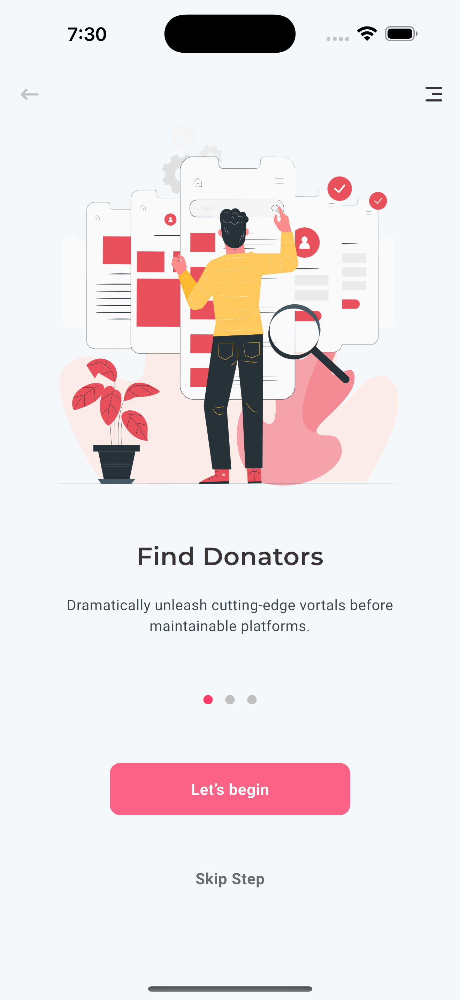
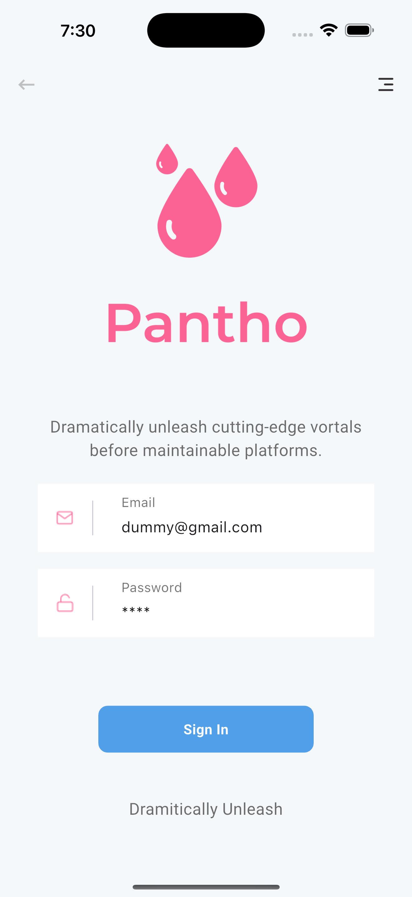
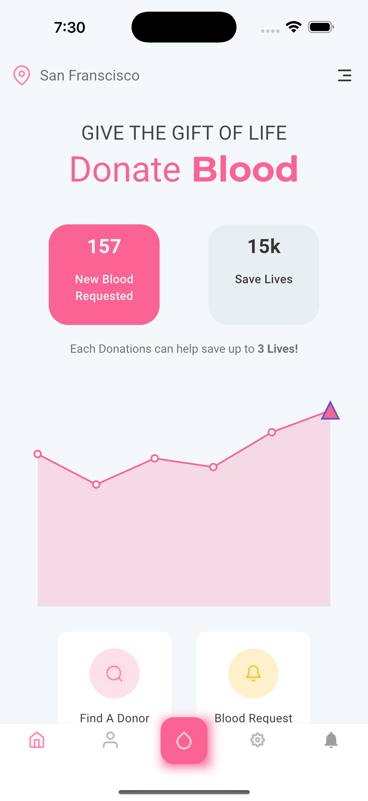
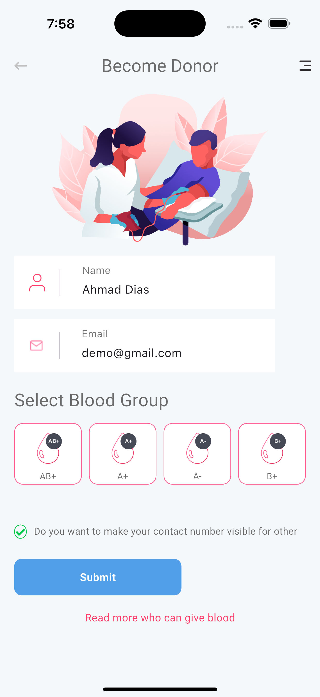
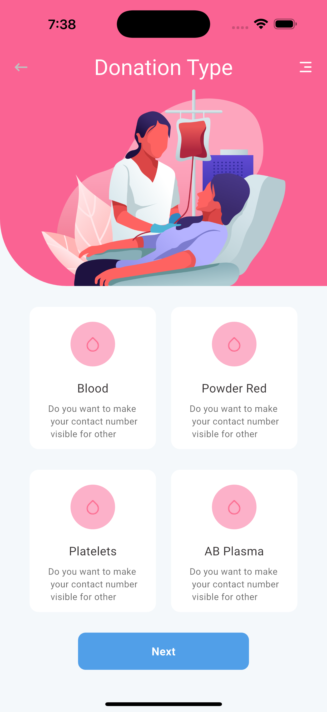
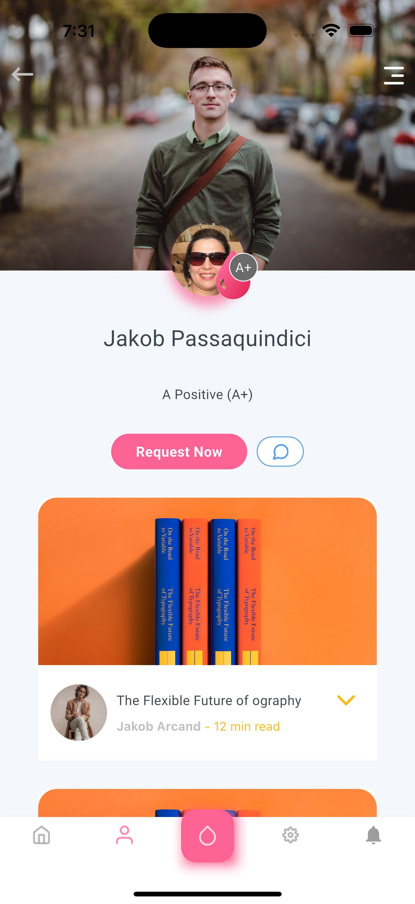

# Pantho - Blood Donation App

A modern blood donation application built with Flutter that connects blood donors with those in need. The app features a clean and intuitive user interface with a focus on user experience.

## Features

- **Onboarding Experience**: Smooth onboarding process for new users
- **Donor Registration**: Easy registration process for blood donors
- **Multiple Donation Types**: Support for various donation types:
  - Whole Blood
  - Plasma
  - Platelets
  - Powder Red Blood Cells
- **Blood Group Selection**: Simple interface for selecting blood groups
- **Profile Management**: User profile management with personal information
- **Contact Visibility Options**: Control over contact information visibility

## Screenshots

Here are some screenshots of the application:

| Onboarding                                         | Sign In                                        | Home                                         |
| -------------------------------------------------- | ---------------------------------------------- | -------------------------------------------- |
|  |  |  |

| Become Donor                                         | Donation Type                                         | Profile                                         |
| ---------------------------------------------------- | ----------------------------------------------------- | ----------------------------------------------- |
|  |  |  |

## Technology Stack

- **Framework**: Flutter
- **State Management**: GetX
- **Architecture**: Clean Architecture
- **UI Components**: Custom widgets for reusability
- **Responsive Design**: flutter_screenutil for adaptive UI
- **Charts**: syncfusion_flutter_charts for data visualization
- **UI Navigation**: Multi-step forms using another_stepper

## Project Structure

```
lib/
├── constants/      # App constants, assets, and texts
├── models/         # Data models
├── routes/         # App navigation routes
├── theme/          # App theming
├── views/          # UI screens
└── widgets/        # Reusable UI components
```

## Getting Started

1. **Prerequisites**

   - Flutter SDK
   - Dart SDK
   - Android Studio / VS Code

2. **Installation**

   ```bash
   # Clone the repository
   git clone https://github.com/yourusername/pantho.git

   # Navigate to project directory
   cd pantho

   # Install dependencies
   flutter pub get

   # Run the app
   flutter run
   ```

## Dependencies

```yaml
dependencies:
  flutter_screenutil: ^5.9.3
  another_stepper: ^1.2.2
  syncfusion_flutter_charts: ^27.1.53
  get: ^4.6.6
  dots_indicator: ^3.0.0
```

## Design System

The app uses a consistent design system with:

- **Typography**: Roboto and Montserrat font families
- **Colors**: Custom color palette defined in theme
- **Components**: Reusable custom widgets for consistency

## Contributing

Contributions are welcome! Please feel free to submit a Pull Request.

## License

This project is licensed under the MIT License - see the LICENSE file for details.
